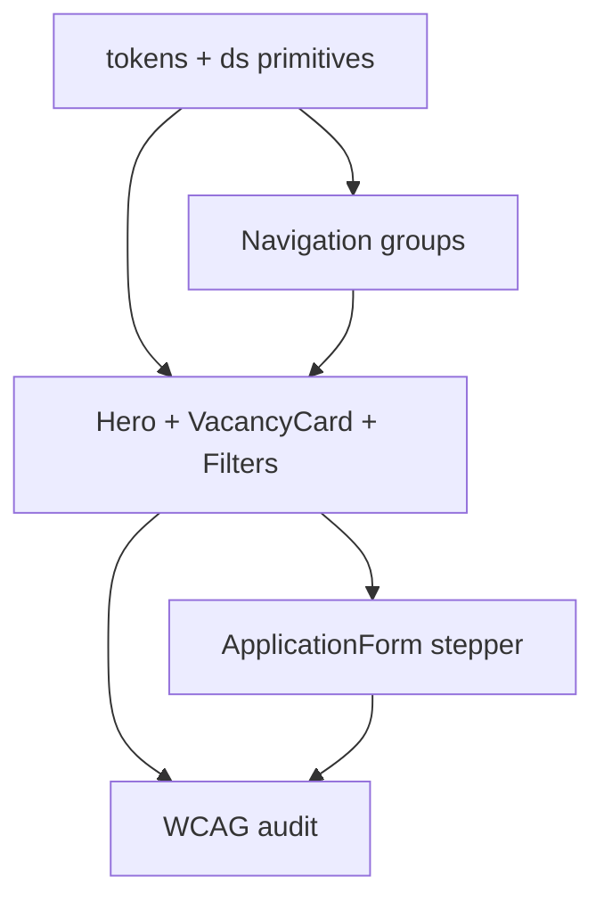

# Кадровый портал — миграция дизайн-системы v2

**Роль:** ArchitectUX (техническая архитектура + UX-фундамент)  
**Дата:** 30 июня 2026  
**Основание:** [UX-DESIGN-RECOMMENDATIONS.md](./UX-DESIGN-RECOMMENDATIONS.md)  
**Стек:** Nuxt 3, Nuxt UI 3, Tailwind CSS v4, `@nuxt/fonts`, `@nuxt/a11y`

---

## 1. Цель миграции

Перевести портал с **набор разрозненных Tailwind-классов** на **единую дизайн-систему v2**: современный официальный стиль госсектора с чёткой иерархией, предсказуемыми компонентами и готовностью к масштабированию.

### Принципы v2

| Принцип | Было (v1) | Станет (v2) |
|---------|-----------|-------------|
| Токены | Только `@theme` primary/secondary | Семантические токены: surface, text, border, accent |
| Типографика | Verdana, ad-hoc `text-3xl` / `text-5xl` | **PT Sans** + шкала `display` → `caption` |
| Поверхности | `bg-white/60`, `backdrop-blur` | Непрозрачные `surface-*` + опциональный blur только в default |
| Секции | `py-6`, `py-8`, `py-12` вперемешку | Единый `Section` с `spacing="md" \| "lg"` |
| CTA | Две равнозначные кнопки на карточке | Primary / secondary / ghost по семантике |
| Hero | Один `office.png` везде | `PageHero` с вариантами `home` / `inner` / `compact` |
| Навигация | 9 плоских ссылок | Группы + persistent CTA «Вакансии» |
| A11y | Классы на `html`, полупрозрачность ломает контраст | `a11y`-режим переключает на solid surfaces |
| Motion | Marquee без адаптива | Сетка на mobile, marquee на `md+`, respect `prefers-reduced-motion` |

### Сохраняем без изменений

- Бренд-цвета: primary `#50C891`, secondary `#2D2382`
- Градиент бренда (используется дозированно)
- Версия для слабовидящих (ГОСТ Р 52872-2024)
- Skip-link, тёмная тема (`UColorModeButton`)
- Nuxt UI как UI-примитив (не переписываем с нуля)

---

## 2. Визуальное направление v2

**«Современная официальность»** — не стартап-неон и не шаблонный AI-лендинг.

- Светлый фон с лёгким тёплым оттенком (`#F7F8FA`), не холодный `#f0f0f0`
- Крупная типографика в hero, сдержанная в контенте
- Карточки с тонкой обводкой и мягкой тенью (не glassmorphism по умолчанию)
- Акцент зелёным только на действиях и ключевых метриках
- Синий — для навигации, заголовков разделов, вторичного бренда
- Щедрые отступы между секциями (64–96px desktop)
- Микро-анимации 150–250ms, без parallax и тяжёлых эффектов

---

## 3. Архитектура CSS

### 3.1. Структура файлов (целевая)

```
frontend/app/assets/css/
├── main.css                 # entry: imports + body base
├── tokens/
│   ├── colors.css           # @theme + semantic aliases
│   ├── typography.css       # font-family, text scale utilities
│   ├── spacing.css          # section rhythm, container
│   ├── shadows.css          # elevation tokens
│   └── motion.css           # durations, easings
├── layout/
│   ├── container.css        # .ds-container
│   └── section.css          # .ds-section
├── components/
│   ├── surfaces.css         # .ds-surface, .ds-surface-elevated
│   ├── buttons.css          # CTA overrides (thin layer over Nuxt UI)
│   └── a11y-overrides.css   # solid surfaces in a11y modes
└── utilities/
    └── prose.css            # long-form text blocks
```

### 3.2. Цветовые токены

**Файл:** `tokens/colors.css`

```css
@theme {
  /* Brand — без изменений палитры */
  --color-primary-500: #50c891;
  --color-secondary-500: #2d2382;
  /* ... остальные шаги primary/secondary из main.css ... */

  /* Semantic surfaces (NEW) */
  --color-surface-default: #f7f8fa;
  --color-surface-raised: #ffffff;
  --color-surface-sunken: #eef0f4;
  --color-surface-brand: #2d2382;
  --color-surface-brand-muted: #f0f2f8;

  /* Semantic text */
  --color-text-primary: #111827;
  --color-text-secondary: #4b5563;
  --color-text-muted: #6b7280;
  --color-text-inverse: #ffffff;
  --color-text-accent: #2d2382;
  --color-text-success: #368863;

  /* Semantic borders */
  --color-border-default: #e5e7eb;
  --color-border-strong: #d1d5db;
  --color-border-brand: #50c891;

  /* Focus */
  --color-focus-ring: #50c891;
}

.dark {
  --color-surface-default: #171244;
  --color-surface-raised: #1f1858;
  --color-surface-sunken: #100d2f;
  --color-text-primary: #f9fafb;
  --color-text-secondary: #d1d5db;
  --color-text-muted: #9ca3af;
  --color-border-default: #352999;
  --color-border-strong: #4536c8;
}

/* A11y: непрозрачные поверхности */
html.a11y-enabled {
  --color-surface-raised: #ffffff;
  --color-surface-default: #ffffff;
  --glass-blur: 0;
  --glass-opacity: 1;
}
```

### 3.3. Типографика

**Шрифт:** PT Sans (Regular 400, Medium 500, Bold 700) через `@nuxt/fonts`.

```ts
// nuxt.config.ts — добавить
fonts: {
  families: [
    { name: 'PT Sans', provider: 'google', weights: [400, 500, 700] }
  ]
}
```

| Токен | Mobile | Desktop | Line-height | Weight | Tailwind utility |
|-------|--------|---------|-------------|--------|----------------|
| `display` | 32px | 48px | 1.1 | 700 | `text-display` |
| `h1` | 28px | 40px | 1.15 | 700 | `text-h1` |
| `h2` | 24px | 32px | 1.2 | 700 | `text-h2` |
| `h3` | 20px | 24px | 1.3 | 600 | `text-h3` |
| `body` | 16px | 16px | 1.6 | 400 | `text-body` |
| `body-lg` | 18px | 18px | 1.6 | 400 | `text-body-lg` |
| `caption` | 14px | 14px | 1.5 | 400 | `text-caption` |
| `overline` | 12px | 12px | 1.4 | 600 | `text-overline uppercase tracking-wide` |

```css
/* tokens/typography.css */
@theme {
  --font-sans: 'PT Sans', system-ui, sans-serif;

  --text-display: 2rem;
  --text-display--line-height: 1.1;
  --text-h1: 1.75rem;
  --text-h1--line-height: 1.15;
  --text-h2: 1.5rem;
  --text-h2--line-height: 1.2;
  --text-h3: 1.25rem;
  --text-h3--line-height: 1.3;
}

@media (min-width: 1024px) {
  :root {
    --text-display: 3rem;
    --text-h1: 2.5rem;
    --text-h2: 2rem;
    --text-h3: 1.5rem;
  }
}

body {
  font-family: var(--font-sans);
  font-size: var(--text-body, 1rem);
  line-height: 1.6;
}
```

### 3.4. Spacing (сетка 4px)

| Токен | Value | Использование |
|-------|-------|---------------|
| `--space-section-sm` | 48px | Компактные блоки |
| `--space-section-md` | 64px | Стандарт секции |
| `--space-section-lg` | 96px | Hero-adjacent, landing |
| `--space-inline` | 16px | Mobile padding контейнера |
| `--space-inline-lg` | 24px | Desktop padding контейнера |
| `--space-gap-cards` | 24px | Сетка карточек |

### 3.5. Elevation (тени)

```css
@theme {
  --shadow-xs: 0 1px 2px rgb(17 24 39 / 0.04);
  --shadow-sm: 0 2px 8px rgb(17 24 39 / 0.06);
  --shadow-md: 0 8px 24px rgb(17 24 39 / 0.08);
  --shadow-brand: 0 8px 24px rgb(80 200 145 / 0.15);
}
```

### 3.6. Motion

```css
@theme {
  --duration-fast: 150ms;
  --duration-normal: 250ms;
  --ease-default: cubic-bezier(0.4, 0, 0.2, 1);
}
```

Интерактив: `transition-[box-shadow,transform] duration-fast ease-default`  
Hover карточки: `hover:-translate-y-0.5 hover:shadow-md`  
**Запрещено в v2:** постоянный marquee на mobile, backdrop-blur в a11y-режиме.

### 3.7. Градиент бренда (дозированно)

```css
@utility bg-gradient-brand {
  background-image: linear-gradient(
    135deg,
    var(--color-secondary-500) 0%,
    var(--color-primary-500) 100%
  );
}
```

**Где использовать:** hero home, акцентная полоска 4px, badge «Новое», **не** — каждый разделитель страницы.

---

## 4. Layout Framework

### 4.1. Container

```html
<!-- Замена произвольных UContainer + mx-4 -->
<div class="ds-container">
  <!-- max-w-7xl mx-auto px-4 sm:px-6 lg:px-8 -->
</div>
```

| Breakpoint | Max-width | Padding |
|------------|-----------|---------|
| default | 100% | 16px |
| sm (640px) | 100% | 24px |
| lg (1024px) | 1280px | 32px |

### 4.2. Section

Единый wrapper для всех блоков страницы.

```vue
<!-- components/ds/Section.vue -->
<template>
  <section
    :class="[
      spacing === 'lg' ? 'py-16 lg:py-24' : 'py-12 lg:py-16',
      variant === 'muted' && 'bg-surface-sunken',
      variant === 'brand' && 'bg-surface-brand text-text-inverse',
    ]"
    :aria-labelledby="headingId"
  >
    <div class="ds-container">
      <slot name="header" />
      <slot />
    </div>
  </section>
</template>
```

### 4.3. Grid-паттерны

| Паттерн | Классы | Применение |
|---------|--------|------------|
| `grid-cards` | `grid grid-cols-1 sm:grid-cols-2 lg:grid-cols-3 gap-6` | Вакансии, новости |
| `grid-sidebar` | `grid lg:grid-cols-[1fr_320px] gap-8` | Деталь вакансии + sticky CTA |
| `grid-hero` | `grid lg:grid-cols-2 gap-8 items-center` | Главный hero |
| `grid-logos` | `grid grid-cols-2 sm:grid-cols-4 gap-6` | Партнёры (mobile) |

### 4.4. Responsive strategy

| Устройство | Ширина | Поведение |
|------------|--------|-----------|
| Mobile | 320–639px | 1 колонка, burger nav, sticky CTA в drawer |
| Tablet | 640–1023px | 2 колонки карточек, сжатое меню |
| Desktop | 1024px+ | Mega-nav группы, 3 колонки, hero 2-col |
| Large | 1280px+ | Container cap, увеличенные section gaps |

---

## 5. Компонентная архитектура

### 5.1. Иерархия

```
1. Design System (ds/*)     — Section, Surface, SectionHeading, SectionDivider, EmptyState, Skeleton*
2. Layout                   — AppHeader, AppFooter, PageHero*
3. Domain                   — VacancyCard, ApplicationForm, StaffCard, ...
4. Pages                    — только композиция, минимум inline-стилей
```

### 5.2. Префикс `ds/`

Новые примитивы — в `frontend/app/components/ds/`:

| Компонент | Назначение | Заменяет |
|-----------|------------|----------|
| `DsSection` | Вертикальный ритм + variant | Разрозненные `UContainer class="py-*"` |
| `DsSectionHeading` | title + subtitle + optional action | Копипаста `max-w-2xl mb-6` + h2 |
| `DsSectionDivider` | Тонкий или brand-акцент | `h-px bg-gradient-brand` × N |
| `DsSurface` | Карточка/панель с elevation | `bg-white/60 backdrop-blur` |
| `DsEmptyState` | Нет данных | Inline empty в carousel, index |
| `DsSkeletonCard` | Loading | Пустой экран при `server: false` |
| `DsFilterBar` | Фильтры + чипы + счётчик | `DropdownFilters` row |
| `DsBadgeStat` | «12 открытых вакансий» | — |
| `DsButton` | Обёртка над `UButton` с семантикой | `Button.vue` + ad-hoc |

### 5.3. Семантика кнопок (`DsButton`)

| Intent | Nuxt UI | Пример |
|--------|---------|--------|
| `primary` | `color="primary" variant="solid"` | Откликнуться, Наши вакансии |
| `secondary` | `color="primary" variant="outline"` | Подробнее |
| `neutral` | `color="neutral" variant="outline"` | Конкурсы, фильтры |
| `ghost` | `color="neutral" variant="ghost"` | Фидбэк, иконки |
| `destructive` | `color="error" variant="solid"` | Сбросить всё (фильтры) |

**Правило v2:** на карточке вакансии `primary` = «Откликнуться» (flex-2), `secondary` = «Подробнее» (flex-1).

### 5.4. PageHero — унификация

Объединить `PageHeroIndex` + `PageHeroElse` → **`DsPageHero`**.

| Variant | Layout | CTA | Фон |
|---------|--------|-----|-----|
| `home` | 2 col, gradient border | Да | Gradient frame + image |
| `inner` | Full-width image overlay | Опционально | Уникальное фото раздела |
| `compact` | Текст only, без image | Нет | `surface-brand-muted` |

Props: `title`, `description`, `variant`, `image`, `imageAlt`, `badge?`, `actions?` (slot).

### 5.5. Навигация v2

**Файл:** `data/navigation.ts` — расширить структуру:

```ts
export interface NavGroup {
  label: string
  items: NavItem[]
}

export const navGroups: NavGroup[] = [
  {
    label: 'О кадрах',
    items: [
      { label: 'О нас', to: '/about' },
      { label: 'Доска почёта', to: '/honorboard' },
      { label: 'Контакты', to: '/contacts' },
    ],
  },
  {
    label: 'Карьера',
    items: [
      { label: 'Вакансии', to: '/vacancies' },
      { label: 'Конкурсы', to: '/tenders' },
      { label: 'Кадровый резерв', to: '/staffreserve' },
      { label: 'Молодёжь', to: '/youth' },
      { label: 'Профразвитие', to: '/profdev' },
    ],
  },
  {
    label: 'Прозрачность',
    items: [
      { label: 'Нет коррупции!', to: '/anti-corruption' },
    ],
  },
]
```

**AppHeader v2:**
- Desktop: Logo | Главная + 3 dropdown-группы | **`UButton` «Вакансии»** | A11y | Theme | Фидбэк
- Mobile drawer: аккордеон групп + primary CTA внизу

### 5.6. Карточка вакансии v2

```
┌─────────────────────────────────────┐
│ [Новое]                    дата     │
│ Заголовок должности (h3)            │
│ 🏛 Орган · 📍 Город                 │
│ 💰 Зарплата (accent green)          │
│ [tag] [tag] [tag]                   │
├─────────────────────────────────────┤
│ [  Откликнуться (primary)  ] [Подр.]│
└─────────────────────────────────────┘
```

- Обводка: `ring-1 ring-border-default`, hover: `shadow-brand`
- Убрать gradient wrapper `p-1` или оставить только для «Новое» / featured
- Дата публикации: `text-caption text-text-muted`

### 5.7. Форма отклика v2

- `UStepper` или кастомный progress: Согласия → Личные → Адрес → Образование → Отправка
- Sticky footer на mobile: «Далее» / «Отправить»
- Секция согласий: collapsible «Что означает каждый пункт?»
- `aria-live="polite"` на toast успеха

### 5.8. Empty & Loading

**`DsEmptyState`:** icon + title + description + optional action  
**`DsSkeletonCard`:** pulse blocks для VacancyCard / UBlogPost

---

## 6. Информационная архитектура (UX Structure)

### 6.1. Visual weight

| Уровень | Элемент | Стиль |
|---------|---------|-------|
| 1 | H1 страницы | `text-display` или `text-h1` |
| 2 | Заголовок секции | `text-h2` |
| 3 | Подзаголовок карточки | `text-h3` |
| 4 | Body | `text-body`, max-w-prose |
| 5 | Meta | `text-caption text-text-muted` |
| CTA | Кнопки primary | min-height 44px, контраст ≥ 4.5:1 |

### 6.2. CTA placement

| Зона | Действие |
|------|----------|
| Header (persistent) | Вакансии |
| Hero home | Наши вакансии + badge счётчика |
| Карточка вакансии | Откликнуться |
| Страница вакансии | Sticky «Откликнуться» (mobile) |
| Footer | Контакты, соцсети |

### 6.3. Доступность (встроена в v2)

- Все `DsSurface` → solid в `html.a11y-enabled`
- Focus: `ring-2 ring-focus-ring ring-offset-2`
- Фильтры: `aria-expanded`, live region для «Найдено: N»
- Touch targets ≥ 44×44px
- Контраст проверять в: light, dark, a11y-high, a11y-inverted

---

## 7. Матрица миграции компонентов

| Текущий файл | Действие | Новый / обновлённый |
|--------------|----------|---------------------|
| `assets/css/main.css` | Рефакторинг | Split на `tokens/*`, `layout/*` |
| `PageHeroIndex.vue` | Merge | `ds/DsPageHero.vue` variant=`home` |
| `PageHeroElse.vue` | Merge | `ds/DsPageHero.vue` variant=`inner` |
| `AppHeader.vue` | Редизайн | Групповое меню + CTA |
| `AppFooter.vue` | Стилизация | Токены surface, без изменений структуры |
| `VacancyCard.vue` | Редизайн | CTA hierarchy, дата, surface |
| `VacancyCards.vue` | Обёртка | `DsSection` + `DsFilterBar` + skeleton |
| `VacancyCarousel.vue` | Обновить | `DsSectionHeading` + link «Все вакансии» |
| `DropdownFilters.vue` | Расширить | Часть `DsFilterBar` |
| `Button.vue` | Replace | `ds/DsButton.vue` |
| `index.vue` | Композиция | Секции через `DsSection` |
| `contacts.vue`, `honorboard.vue` | Контент + hero | `DsPageHero` + реальные тексты |
| `ApplicationForm.vue` | UX | Stepper + sticky footer |
| `useAccessibility.ts` | Расширить | Toggle solid surfaces class |
| `navigation.ts` | Расширить | `navGroups` |

---

## 8. План внедрения (фазы)

### Фаза 0 — Foundation (3–5 дней)

**Цель:** токены и примитивы без визуального хаоса.

- [ ] Создать `tokens/*.css`, подключить в `main.css`
- [ ] Подключить PT Sans через `@nuxt/fonts`
- [ ] Реализовать `DsSection`, `DsSectionHeading`, `DsSurface`, `DsSectionDivider`
- [ ] Добавить `a11y` overrides для solid surfaces
- [ ] Документировать токены в Storybook или `/design-system` dev-странице (опционально)

**Критерий готовности:** одна тестовая страница собрана только из `ds/*`.

### Фаза 1 — Critical UX (5–7 дней)

Связь с H1–H5 из UX-отчёта.

- [ ] `DsPageHero` + уникальные тексты/изображения для разделов
- [ ] Исправить `contacts.vue`, `honorboard.vue` (убрать заглушки)
- [ ] `VacancyCard` v2 — CTA hierarchy
- [ ] `DsFilterBar` — счётчик + чипы + сброс
- [ ] `DsSkeletonCard` на главной и `/vacancies`
- [ ] FAQ — краткие ответы

### Фаза 2 — Navigation & Layout (5 дней)

- [ ] `navGroups` + mega-menu / mobile accordion
- [ ] Header CTA «Вакансии»
- [ ] Миграция главной на `DsSection`
- [ ] Партнёры: grid mobile / marquee desktop
- [ ] `DsEmptyState` везде

### Фаза 3 — Forms & Polish (5 дней)

- [ ] `ApplicationForm` stepper + sticky footer
- [ ] `aria-live` на успех отклика
- [ ] Единые breadcrumbs (`UBreadcrumb` на всех inner pages)
- [ ] Аудит контраста WCAG (4 темы)
- [ ] Удалить deprecated: старые hero, дубли `Button.vue` если заменён

### Фаза 4 — Enhancement (backlog)

- [ ] Глобальный поиск (Command palette / `UCommandPalette`)
- [ ] Промо `VacancySubscribeForm` на главной
- [ ] Уникальные иллюстрации по разделам

---

## 9. Nuxt UI — конфигурация v2

**`app.config.ts`:**

```ts
export default defineAppConfig({
  ui: {
    colors: {
      primary: 'primary',
      secondary: 'secondary',
      neutral: 'slate',
    },
    button: {
      defaultVariants: {
        size: 'md',
      },
      compoundVariants: [
        {
          color: 'primary',
          variant: 'solid',
          class: 'font-medium min-h-11',
        },
      ],
    },
    card: {
      slots: {
        root: 'ring-1 ring-[var(--color-border-default)] shadow-xs',
      },
    },
  },
})
```

---

## 10. Примеры кода для разработчиков

### 10.1. Секция на странице (после миграции)

```vue
<template>
  <DsSection spacing="lg">
    <DsSectionHeading
      title="Актуальные вакансии"
      description="Открытые должности в администрации Сургутского района"
    >
      <template #action>
        <DsButton intent="secondary" to="/vacancies" trailing-icon="i-lucide-arrow-right">
          Все вакансии
        </DsButton>
      </template>
    </DsSectionHeading>

    <div v-if="pending" class="grid-cards">
      <DsSkeletonCard v-for="i in 3" :key="i" />
    </div>

    <div v-else-if="!vacancies.length">
      <DsEmptyState
        icon="i-lucide-search-x"
        title="Вакансии не найдены"
        description="Попробуйте изменить фильтры"
      />
    </div>

    <div v-else class="grid-cards">
      <VacancyCard v-for="v in vacancies" :key="v.id" :vacancy="v" />
    </div>
  </DsSection>
</template>
```

### 10.2. DsSurface (замена glass)

```vue
<DsSurface elevation="sm" padding="lg">
  <h3 class="text-h3 text-text-primary">Заголовок</h3>
  <p class="text-body text-text-secondary mt-2">Контент</p>
</DsSurface>
```

```css
/* components/surfaces.css */
.ds-surface {
  background: var(--color-surface-raised);
  border: 1px solid var(--color-border-default);
  border-radius: 0.75rem;
}

.ds-surface[data-elevation='sm'] {
  box-shadow: var(--shadow-sm);
}

html.a11y-enabled .ds-surface {
  backdrop-filter: none;
  opacity: 1;
}
```

### 10.3. useAccessibility — solid mode

```ts
// Дополнение к useAccessibility.ts
function applyToDocument(settings: A11ySettings) {
  // ...existing...
  html.classList.toggle('a11y-solid-surfaces', settings.enabled)
}
```

---

## 11. Чеклист регрессии при миграции

- [ ] Все 9 разделов ТЗ доступны из навигации
- [ ] Форма отклика отправляется, валидация работает
- [ ] Версия для слабовидящих: шрифт + контраст + без blur
- [ ] Тёмная тема: все новые surfaces читаемы
- [ ] Mobile 375px: нет horizontal scroll
- [ ] Lighthouse Accessibility ≥ 90
- [ ] Нет `Test` / placeholder контента
- [ ] `prefers-reduced-motion`: нет marquee

---

## 12. Зависимости между задачами



---

## 13. Метрики успеха миграции

| Метрика | Как измерить | Цель |
|---------|--------------|------|
| Design debt | Кол-во уникальных `py-*` на страницах | −80% |
| Компоненты ds/* | Покрытие страниц | ≥ 90% секций |
| CLS | Lighthouse | < 0.1 |
| Конверсия отклика | Analytics | +20% за 6 мес. |
| A11y score | Lighthouse + ручной аудит | ≥ 90 |

---

## 14. Связанные документы

- [UX-DESIGN-RECOMMENDATIONS.md](./UX-DESIGN-RECOMMENDATIONS.md) — исследование и обоснование
- `frontend/app/assets/css/main.css` — текущие токены (источник миграции)
- `frontend/app/data/navigation.ts` — IA
- `frontend/nuxt.config.ts` — fonts, modules

---

**ArchitectUX**  
**Статус:** Ready for developer implementation  
**Следующий шаг:** Фаза 0 — создать `tokens/colors.css` и компоненты `ds/Section`, `ds/Surface`, `ds/SectionHeading`
